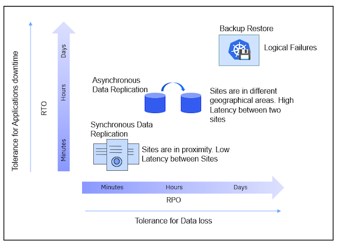
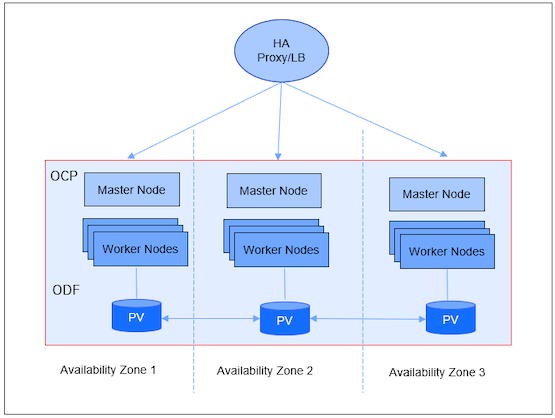
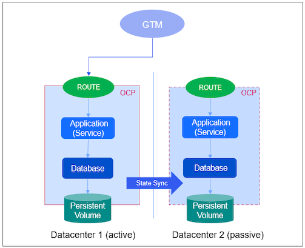
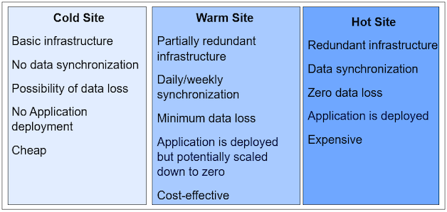
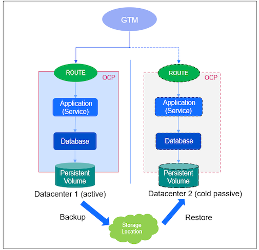
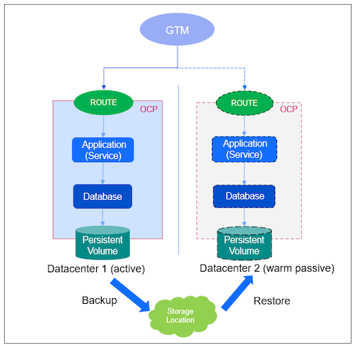
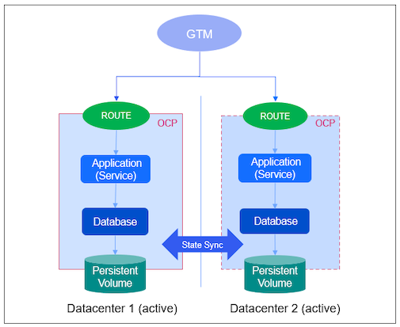
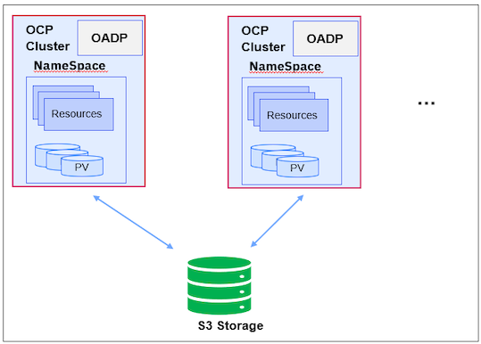

High Availabilty and Disaster Recovery Stratgies

A resilient includes system should be continuous and highly available and have processes and policies that enable recovery from disaster. This article outlines the   options regarding HA/DR for applications deployed on OpenShift.

**High Availability (HA)** means that an application is available regardless of underlying failures. It refers to the system having multiple points of failure by adding redundancy to the system to ensure continuous operations or uptime for an extended period. High Availability ensures your systems, databases, and applications operate when and as needed. An example scenario where high availability comes into play is when a node fails, and Kubernetes reschedules any lost pods to surviving nodes. 

**Disaster Recovery (DR)** means action needs to be taken to recover applications in the event of a disaster. We need to make sure our systems can survive a disaster, which usually means building a second system in a location removed from the primary so that local events such as weather, earthquakes, or meteors won’t damage both systems.  An example scenario where disaster recovery is needed is when the entire cluster is lost, and the workload must be recovered to a new cluster. The primary goal is to minimize the overall impact of a disaster on business performance. 

By understanding potential points of failure, and risks, you can architect both your applications and your clusters to be as resilient as necessary at each specific level. Depending on the failure type two types of solutions can be used, Backup Solutions and Disaster Recovery Solutions.

- Backup Solutions
  - Protection against logical failures 
  - Restore to the previous point-in-time copy of the data and/or the application state
- Disaster Recovery Solutions
  - Protection against physical HW failures and Data Center disasters 
  - Failover to remote Cold (Standby) or Hot Site

Recovery Time Objective (RTO) and Recovery Point Objective (RPO) are vital parameters in any disaster recovery or data protection plan. 

Recovery Point Objective (RPO) is a time-based measurement of the maximum amount of data loss that is acceptable to an organization. It is the time between each backup of data. If the last available backup is from 10 hours ago, and the RPO is 12 hours, then it is within the business continuity plan’s RPO parameters. It answers, “Up to what point in time does the business process’s recovery continue acceptably given the volume of data lost during that interval?”

Recovery Time Objective (RTO) is the duration of time in which a business process must be restored after the disaster to avoid a break in business continuity. It answers, “How much time does it take to recover from business process disruption?”

The RPO/RTO, along with a business impact analysis, provides the basis for identifying strategies for the business continuity plan. There is always some gap between the actuals and objectives because of various manual and automated steps to bring the business application up. These actuals can only be exposed by disaster and business disruption tests.

## Resiliency Solutions for different Service level objectives
Protection against a wide spectrum of failures is available:
- Backup Restore: Built on snapshot-based technology. Most customers start with the backup/restore solution. The multiple copies of the backup are kept and can be reverted to the right copy of the backup. This can be used in the following scenarios:
  - Backup before upgrading to a new version or applying any updates. It can be restored to an earlier point in case something goes wrong.
  - Cluster goes down (DR). A new cluster can be instantiated and restored (See Active/Passive Scenario section). 
  - Create a development/QA environment
- Data centers in different geographical areas. If a site goes down, the requests can be processed by an active cluster on the second site.
  - No latency dependency
  - Asynchronous data replication. The replication interval is between 5 – 15 mins.
  - You can optionally have an external storage RHCS (separate from OCP clusters that run workloads) with an Arbiter node (control plane) in the neutral zone and have synchronous mirroring across Persistent Volumes in both sites (latency < 10ms) for reliability.
- Data centers in proximity to sites
  - Latency should be < 10ms
  - Synchronous replication between sites

## Scenarios
### Scenario-Customer can deploy workloads in three availability zones
Deploying an OpenShift cluster across at least three availability zones is a recommended option for a highly available cluster. Control plane nodes are distributed across availability zones. Given that network communication across cloud availability zones has low enough latency to satisfy etcd requirements, the above approach works on most hyperscale cloud providers. However, this tactic will not work across cloud regions, which have much higher latency for region-to-region communication. 

- Application deployed on a cluster that is stretched across multiple zones in a region
- ODF (storage layer) provides synchronous consistent copies across all Availability Zones (AZs) ensuring no data loss during zone failure
- ODF has 3 replicas by default and can be stretched across availability zones
- Suitable for public cloud platforms with regions supporting 3 or more AZs
  - Can be deployed on-prem when AZs are connected by networks with <10ms latency
  
 

### Scenario-Customer has two data centers
A stretched cluster between two sites, where one site hosts two control plane nodes and the other hosts the third control plane, does not increase the availability.  When a cluster with two control plane nodes fails, will result in the cluster being unavailable. The potential failure of components between two sites can contribute to the cluster being unavailable. This is a supported configuration but does not increase availability. The better option with two sites is to deploy an OpenShift cluster in each of the two data centers and have a global load balancer in front of them. However, this does require some application awareness and monitoring to ensure that the correct instance is active and that any persistent data used by the application is replicated appropriately.

### Active/Passive 
**Active/Passive scenario** where a global load balancer sends all traffic to one location and the app manages replication to the secondary location. The application is deployed on an active cluster.
The storage would need to be replicated in line with their Recovery Time Objective (RTO) and re-introduced to the destination cluster accordingly. For replicating application data, infrastructure level replication, for example, (a)synchronous storage replication, or application-level replication, for example, DB2 backup and restore can be used. 

There are three types of DR sites: Cold, Warm, and Hot sites.

#### Active/Passive with backup (Cold DR)
- Create an OCP cluster in the cold site when a disaster hits.
- Application is backed up periodically. When a disaster hits, the application can be restored to the passive site.
- It requires less infrastructure and is cheap.

#### Active/Passive with backup (Warm DR)
- An OCP cluster is running on the passive (standby) site. The application is deployed but potentially scaled down to zero.
- Application is backed up periodically.
- Application can be restored on the passive site periodically or can be restored to the passive/standby site when disaster hits.
- It requires minimum infrastructure for the passive/DR site. More resources can be added to the passive/DR site when disaster hits and the DR site become the primary site.

#### Active/Passive with backup (Hot DR)
- An OCP cluster is running on the passive (standby) site. The application is deployed on the DR site.
- Application is backed up periodically.
- Application can be restored on the passive site periodically.
- It requires redundant infrastructure for the passive/DR site.

### Active/Active
**Option 2: Active/Active scenario** where the global load balancer sends traffic to both locations and the app manages cross-replication between them. RTO/RPO = 0. It requires more infrastructure and resources. 

In addition to potential points of failure discussed above, ensuring availability of storage is critical for successful high availability of stateful applications.

#### Storage availability
The best ways to maintain the availability of storage are to use replicated storage solutions, shared storage that is unaffected by outages, or a database service that is independent of the cluster.

### Application Backup with OADP (Open API Data Protection)
Application granular and cluster consistent backups using OADP operator and snapshots with CSI interface ensure backup with open standards.

This open-source operator sets up and installs Velero on the OpenShift platform, allowing users to backup and restore applications. It ensures OCP version independence and works across storage providers (via plug-ins).  It allows you to back up namespace or user labels and persistent volumes using the CSI snapshot interface.  It can backup Persistent Volume data (PV) if the storage provider supports the CSI snapshot interface. 

[https://community.ibm.com/community/user/iot/blogs/sarika-budhiraja1/2021/12/31/backup-restore-mas-manage](https://community.ibm.com/community/user/iot/blogs/sarika-budhiraja1/2021/12/31/backup-restore-mas-manage)

This blog explains how to install and use the OADP operator to take the application backup. The operator uses the plugin to take the PVs backup for the Manage app attached docs. You need to have storage classes installed to use PVs.  

### HA Practices for MAS Prerequisites

Prerequisite   |  High Availability  | References  | 
------ |  -------- | -------------------------- |
OpenShift | Use Availability Zones    Label nodes using topology.kubernetes.io/zone  | [Nodes scheduler pod topology spread constraints](https://docs.openshift.com/container-platform/4.6/nodes/scheduling/nodes-scheduler-pod-topology-spread-constraints.html)    [Pod topology spread constraints](https://kubernetes.io/docs/concepts/workloads/pods/pod-topology-spread-constraints)    [Kubernetes topology zone annotations](https://kubernetes.io/docs/reference/labels-annotations-taints/#topologykubernetesiozone)|
File System | ODF (OCS)    Portworx | [OpenShift Data Foundation](https://cloud.ibm.com/docs/openshift?topic=openshift-ocs-storage-prep)    [Storing data on IBM Cloud File Storage](https://cloud.ibm.com/docs/openshift?topic=openshift-file_storage)    [Portworx videos](https://docs.portworx.com/reference/portworx-instructional-videos)|
DB2 Warehouse | Db2 Warehouse SMP HADR   IBM Data Replication for Db2 Continuous Availability    Built-in high availability feature for IBM Db2 Warehouse  MPP deployments w/highly available cluster file system  across AZ (ODF or Portworx) | [HADR on Db2 Warehouse SMP](https://www.ibm.com/docs/en/cloud-paks/cp-data/3.5.0?topic=warehouse-hadr-db2-smp)    [IBM DB2 Data Replication for Availability](https://www.ibm.com/docs/en/drfa/1.0?topic=setting-up-replication)    [High availability feature for IBM Db2 Warehouse MPP deployments](https://www.ibm.com/docs/en/db2-warehouse?topic=recovery-built-in-high-availability-feature-mpp-deployments) |
MongoDB | Use ReplicaSet with one primary and 2 secondaries each in one AZ | [How to Deploy a MongoDB ReplicaSet](https://www.youtube.com/watch?v=Q2lJH156SUQ&list=PL34sAs7_26wPvZJqUJhjyNtm7UedWR8Ps&index=8) |
Kafka | Strimzi based rack aware    Kafka CR rack: topologyKey: topology.kubernetes.io/zone | [Strimzi configuration](https://strimzi.io/docs/operators/latest/using.html#type-Rack-reference)    [Strimzi kafka operators](https://strimzi.io/docs/operators/0.20.0/using.html#assembly-kafka-rack-deployment-configuration-kafka) |

### DR Practices for MAS Prerequisites

Prerequisite   |  Disaster Recovery  | References  | 
------ |  -------- | -------------------------- |
OpenShift | Use OADP and its plugins | [Backup Restore](https://community.ibm.com/community/user/iot/blogs/sarika-budhiraja1/2021/12/31/backup-restore-mas-manage) |
File System | Normal file system copy ||
DB2 Warehouse | DB2 Warehouse HADR (CP4D)   DB2 Warehouse backup/restore | [Db2 high availability disaster recovery](https://www.ibm.com/support/producthub/icpdata/docs/content/SSQNUZ_latest/svc-db2/aese-hadrovu.html)    [DB2 Warehouse disaster recovery](https://www.ibm.com/docs/en/db2-warehouse?topic=warehouse-backup-restore-disaster-recovery) |
MongoDB | Back Up and Restore with MongoDB Tools | [MongoDB backup and restore](https://docs.mongodb.com/manual/tutorial/backup-and-restore-tools) |
Kafka | Mirror Maker 2   Kafka Backup | [Kafka Mirror Maker](https://ibm-cloud-architecture.github.io/refarch-eda/technology/kafka-mirrormaker)    [Kafka backup](https://medium.com/@anatolyz/introducing-kafka-backup-9dc0677ea7ee) |

### MAS Core

Data type   |  Description  | HA Strategy  | DR Strategy | Comments |
---- | --------- | ---------- | --------- | ------- |
Application Code | Product Images | Multiple redundant copies (pods) of the critical microservices spread across AZs. Less critical ones get restarted by OCP| Reinstall | Reinstallation takes several minutes |
Custom Code | None | N/A | N/A||
Running State | Kept by pre-reqs (e.g. SLS) | N/A | N/A ||
Configuration Data | Kubernetes config (secrets, configmaps) held in etcd. Other config data is held in MongoDB.| Etcd uses mirroring (set up by OCP install)    MongoDB uses mirroring (set up by default by customer) | OpenShift data can be backed up and restored, alternatively it can be recreated by application reinstall.   MongoDb, has backup/restore procedures ||
Runtime Data | None | N/A | N/A ||

### MAS SLS

Data type   |  Description  | HA Strategy  | DR Strategy | Comments |
------ | ----------- | ----------- | ---------- | ------ |
Application Code | Currently based still on Flexera, but will change in the future (read notes) | Can’t have HA, it is a SPoF | Redeploy | |
Custom Code | N/A | N/A | N/A | |
Running State | Kept by Runtime Data | Can’t have HA, it is a SPoF | N/A ||
Configuration Data | SLS holds the Customer’s license file and credentials to access MongoDB. | None | Reuse the license file and the MongoDB credentials | The license file is held by a ConfigMap, and MongoDB credentials by a Secret, therefore when backup cluster config, this will be picked up as well. The same info can be supplied by MAS when it configures SLS. The license is available in License Key Server (LKC), so in effect, LKC is the DR backup technology |
Runtime Data | Rational License Key Server (Flexera) store, eventually MongoDB | Can’t have HA, it is a SPoF | None (see comment) | SLS has a runtime state in Mongo so a true DR approach might consider how Mongo is handled. However, in principle MAS should be able to reconcile and rebuild this state automatically |

### Manage

Data type   |  Description  | HA Strategy  | DR Strategy | Comments |
------ | ---------- | ------------- | ------------| --------- |
Application Code | Base product image "+"  additional functional code | Can’t have full HA  Separate Classic UI with running state from the rest Multi-AZ deployment ||
Custom Code | Code packaged and available on HTTP share   Scripts part of Runtime Data | None  Same as Runtime Data | Make sure the same HTTP share is available from the DR site  Same as Runtime Data||
Running State | Session state maintained by JSP serving Classic UI | No solution for Classic UI   Long term approach to make all application code stateless | None ||
Configuration Data | ConfigMaps, Secrets, CRDs, CRs | OpenShift multi-AZ deployment | Backup/Restore possibly using Velero and its addons ||
Runtime Data | Backend SQL database (DB2, Oracle, MSSQL)| Active-active replication provided by DB technology or infrastructure base disk mirroring | Backup/Restore ||

### DB2 High Availability Disaster Recovery (HADR)
You can configure Db2® high availability disaster recovery (HADR) in a single Red Hat® OpenShift® project or in different OpenShift projects.
[https://www.ibm.com/docs/en/cloud-paks/cp-data/4.0?topic=hadr-configuring-starting](https://www.ibm.com/docs/en/cloud-paks/cp-data/4.0?topic=hadr-configuring-starting)

If you are installing services that depend on Db2® and you are planning to use IBM® Cloud File Storage on NFS 4 for persistent storage, you must configure ID mapping, which enables no_root_squash. Configuring no_root_squash allows root clients to retain root permissions on the remote NFS share.
[https://www.ibm.com/docs/en/cloud-paks/cp-data/4.0?topic=storage-setting-up-cloud-file](https://www.ibm.com/docs/en/cloud-paks/cp-data/4.0?topic=storage-setting-up-cloud-file)

